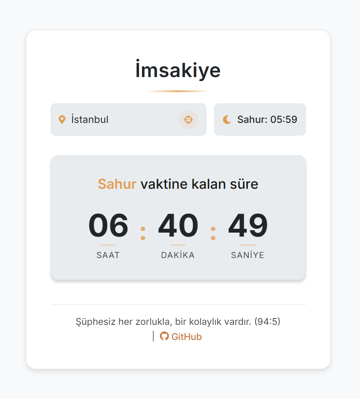

<div align="center">
 <h1>İmsakiye</h1>
 <p>
  A web application designed to provide Iftar and Sahur times during the month of Ramadan.
 </p>
 
</div>

## Table of Contents
- [Overview](#overview)
- [Features](#features)
- [How to Use](#how-to-use)
- [Operation Logic](#operation-logic)
- [Technology Stack](#technology-stack)
- [Setup](#setup)
  - [Requirements](#requirements)
  - [Installation](#installation)
  - [Configuration](#configuration)
- [Usage](#usage)
- [License](#license)
- [Notes](#notes)

---

# İmsakiye Web Application

## Overview

İmsakiye is a web application designed to provide users Iftar and Sahur times during the month of Ramadan. It leverages the user's location (either through browser geolocation or IP-based lookup) to fetch prayer times from the Aladhan API and displays a countdown timer to the next Iftar or Sahur. The application supports Turkish, offers a light and dark theme, and includes a robust location search feature tailored for Turkey using a local JSON file for fast and efficient lookups. The app provides a clean, modern, and responsive user interface, ensuring a seamless experience across various devices.

## Features

- **Location-Based Prayer Times:**
  - Browser Geolocation (with fallback to IP-based lookup)
  - Manual Location Selection (via a searchable dropdown)
- **Countdown Timer:** Real-time countdown to the next Iftar or Sahur.
- **Dynamic Target Time Determination:** Switches automatically between Iftar and Sahur countdowns.
- **Turkish Location Search:**
  - Debouncing to reduce API calls during rapid typing.
  - Turkish character normalization (e.g., "İ" to "i").
  - Highlighting of matching search terms.
  - Keyboard navigation (arrow keys, Enter, Escape).
- **Theme Switching:** Light and dark themes, saved in `localStorage`.
- **Responsive Design:** Optimized for various screen sizes.
- **Accessibility:**
  - ARIA attributes for screen readers.
  - `prefers-reduced-motion` support.
  - High contrast support (`forced-colors` media query).
  - Keyboard navigation for location search.
- **Error Handling:** Displays user-friendly messages for API errors.
- **Loading Indicator:** Spinner while fetching data.
- **Cookie-Based Location Saving:** Remembers last selected location.
- **Iftar Notification:** "İftar Vakti!" message with animation.
- **Info Button:** Displays a disclaimer about accuracy.

## How to Use

1. **Opening the app:** It attempts to detect your location automatically.
2. **Manual Location Selection:**
   - Click the location display.
   - Start typing your city/district name.
   - Select from the dropdown list.
   - Use the location button to retry auto-detection.
3. **Viewing Countdown:** Displays the time until the next Iftar or Sahur.
4. **Changing Theme:** Click the moon/sun icon.
5. **Viewing Info:** Click the info icon.

## Operation Logic

1. **Initialization:**
   - Retrieves saved location from cookies.
   - Attempts geolocation or IP-based lookup.
   - Fetches prayer times from Aladhan API.
   - Loads JSON file of Turkish cities.
   - Sets up the theme.

2. **Location Detection:**
   - **Geolocation:** Browser API for coordinates, reverse geocoding (Nominatim).
   - **IP-based Lookup:** Fallback using `ip-api.com`.
   - **Manual Selection:** User selects from a dropdown list.

3. **Prayer Time Fetching:**
   - Uses Aladhan API (method 13 - DİB, school 1 - Hanefi, calendarMethod 'DIYANET').
   - Custom user agent in API request headers.

4. **Countdown Calculation:**
   - Determines countdown to Iftar (Maghrib) or Sahur (Fajr).
   - `updateCountdown` function updates display in real-time.

5. **Theme Management:**
   - Checks for saved theme in `localStorage`.
   - Defaults to system theme (`prefers-color-scheme`).
   - User toggle saves preference in `localStorage`.

6. **Location Search:**
   - Debounced input for efficiency.
   - Filters Turkish locations.
   - Displays results in a dropdown list.
   - Updates location and fetches new prayer times.

7. **Cookie Management:**
   - Saves selected location persistently.

## Technology Stack

- **Frontend:**
  - HTML5
  - CSS3 (with CSS variables for theming)
  - JavaScript (ES6+)
- **APIs:**
  - Aladhan API (prayer times)
  - Nominatim (reverse geocoding)
  - ip-api.com (IP-based geolocation)
- **Data:**
  - `data/locations.json`: List of Turkish cities/districts.
- **Fonts:**
  - Google Fonts (Inter)
  - Font Awesome (icons)

## Setup

### Requirements

- A modern web browser with JavaScript enabled.
- Internet connection (for fetching prayer times and location data).

### Installation

```bash
# Clone the repository
git clone https://github.com/mdonmez/imsakiye.git

# Navigate to the project directory
cd imsakiye

# Open HTTP server (Python example)
python -m http.server
```

Then, go to the provided URL in your browser.

### Configuration

- **Default Location:** `DEFAULT_LOCATION` in `script.js` (fallback: Istanbul).
- **Turkish Locations:** Modify `data/locations.json` to update cities.

## Usage

- Serve manually or visit the hosted version: [İmsakiye](https://dub.sh/imsakiye)

## License

This project is licensed under the MIT License - see the [LICENSE](LICENSE) file for details.

## Notes

- The app is in development and may have bugs.
- Built mostly using AI tools, so code quality may vary. (Including this README!)